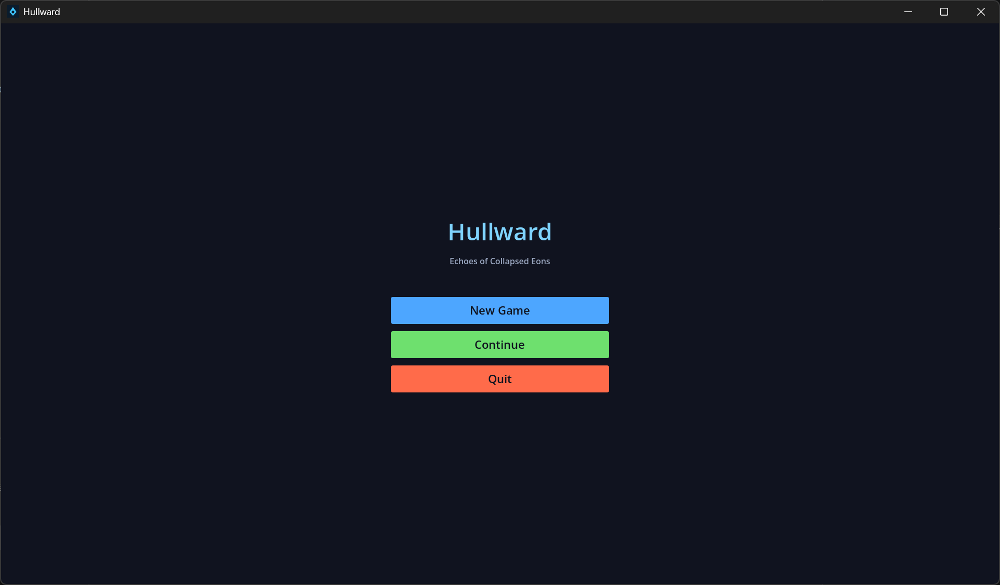
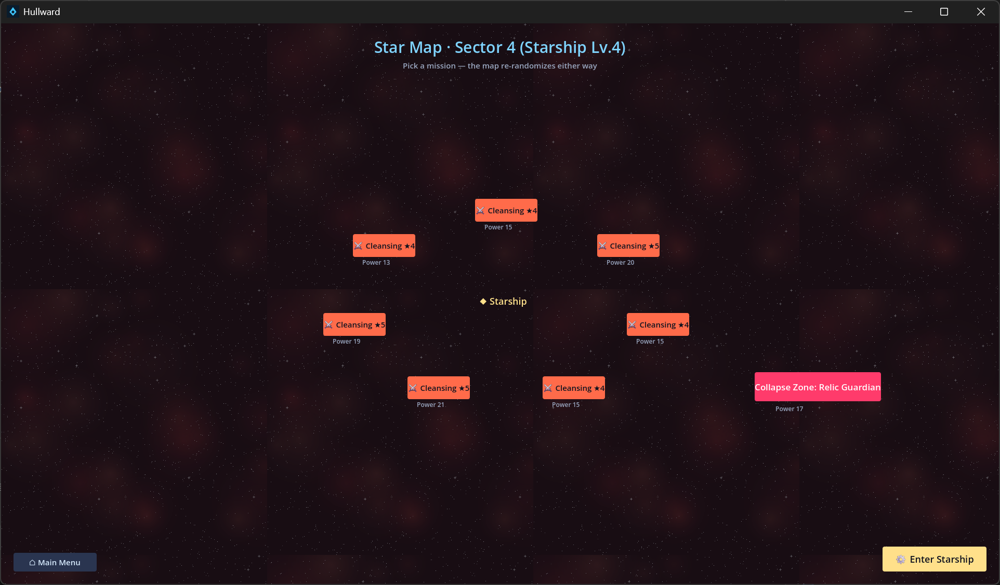
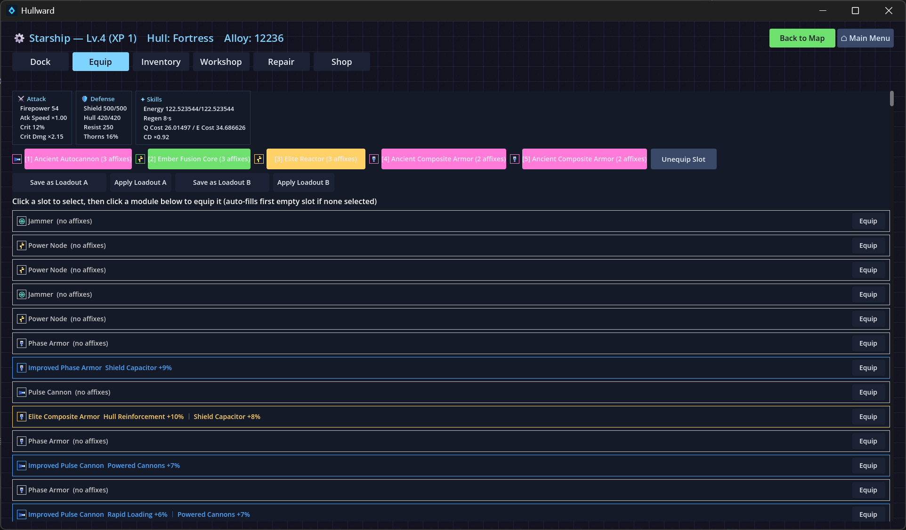

# Hullward (《深空暗骸》 / Deep Space Relics)


A space-ship ARPG loot game — Deakin SIT771 "Something Awesome" 7.4H project.
Tech stack: **Godot 4.7.2 (.NET build) + C# / .NET 8**.

## Gameplay (mission loop · UI spec v0.2)

1. **Main menu**: start a new run (name the captain) / continue (multi-save, shows captain names only)
2. **Starmap**: mothership at center, 4-8 random mission nodes (Cleansing / Boss) with danger rating ★ and power
3. **Mothership interior** (Dock / Inventory / Fit / Workshop / Repair / Shop): resupply and fit before sortie
4. **Mission combat**: main gun auto-targets and fires + `Q` overload cannon / `E` shield boost; clear all hostiles to win
5. **Settlement**: every sortie (win or lose) consumes one "turn"; the starmap re-randomizes on return; run auto-saves
6. **Progression**: missions grant mothership XP -> mothership level up -> sectors unlock (4 sectors) + shop/workshop unlock more
7. **Loot**: destroyed enemies drop modules (Common/Magic/Rare/Set/Ancient, 5 rarities + affixes) and alloy; manual fitting + affix reroll

## Mothership interior (LD spec §6)

| Tab | Function |
|---|---|
| Dock | Switch flagship between 4 ship classes (Scout / Assault / Battleship / Fortress) |
| Fit | Visual slots (click select/equip/unequip), real-time stat preview (firepower/shield/hull/attack speed/resist/MF), 2 loadouts |
| Inventory | Module list, filter by rarity (All/Common/Magic/Rare/Set/Ancient) |
| Workshop | Disassemble (Common 1 / Magic 3 / Rare 8 / Set 15 alloy, Ancient cannot be disassembled); Reroll (Rare+ re-rolls affixes, cost 5/10/20/40...) |
| Repair | Hull restore (alloy cost by damage ratio) |
| Shop | Common/Magic module supply (alloy-priced, no high-tier) |

## Affix system (LD affix table §3)

- Affix count by rarity: Common 0 / Magic 1-2 / Rare 2-3 / Set 3 / Ancient 2 (strong ancient-tier values)
- Slot affix pools are weight-drawn, no duplicate stat per module; values uniformly random within rarity range
- Wired effects: Powered Cannons -> firepower, Rapid Loading -> attack speed, Shield Capacitor -> shield, Hull Reinforcement -> hull, All-Resist -> resist, Magic Find -> loot bonus
- Other affixes (crit/slow/Aoe blast/energy/EMP etc.) generate and reroll in the loop; combat-effect interface reserved

## Controls

| Key | Function |
|---|---|
| Mouse | Menus / pick mission on starmap / mothership UI |
| WASD / Arrow keys | Move |
| Q / E | Overload Cannon / Shield Boost |
| F5 / F9 | Quick save / load (auto-save on settlement) |
| Esc | Pause/resume (useful for screenshots) |

## Sectors (unlock by mothership level)

| Sector | Unlock | Enemies |
|---|---|---|
| Sector 1 Beacon | Start | Recon, Assault |
| Sector 2 Starport | Mothership Lv 2 | + Fortress |
| Sector 3 Deep Space | Mothership Lv 3 | + Swarm drones |
| Final Collapse | Mothership Lv 4 | Collapse Guardian (Boss) |

## Run (editor / dev)

```powershell
# Double-click run_game.bat (repo root), or:
D:\pg\Godot_v4.7.2-stable_mono_win64\Godot_v4.7.2-stable_mono_win64.exe --path Hullward
```

## Run (release)

```powershell
Hullward\build\Hullward.exe   # release exe (bundles .NET runtime; no Godot install needed)
```

## Tests

```powershell
dotnet test Hullward\Hullward.sln    # 228 domain-layer unit tests
dotnet build Hullward\Hullward.sln   # 0 error / 0 warning
```

## Save location

```
%APPDATA%\Godot\app_userdata\Hullward\saves\<captain-name>.json
```

Save contains: sector / alloy / hull / inventory modules (with affixes and reroll count) / mothership level & XP / **fitted sortie slots**.

## Architecture

```
Hullward/
├── src/
│   ├── Domain/     # Pure C# domain layer (zero Godot dependency, xUnit-testable)
│   │   ├── Ships/      # ShipBase abstraction hierarchy (Scout/Assault/Battleship/Fortress)
│   │   ├── Modules/    # IShipModule interface + affix system + manual fitting + loadouts
│   │   ├── Enemies/    # EnemyShip polymorphic hierarchy (Recon/Raider/Bastion/Swarm/Boss)
│   │   ├── Combat/     # Settlement / targeting / active skills
│   │   ├── Loot/       # Loot table / workshop (disassemble/reroll/repair) / shop
│   │   ├── WorldGen/   # Sector generation / starmap mission generation / sector catalog
│   │   └── Save/       # Multi-file named saves (affix/fit persistence)
│   └── Game/       # Godot presentation layer (UI screens / mothership panel / node rendering / input / HUD)
├── tests/           # xUnit test project
├── docs/            # Design docs / ULO evidence docs
└── build/           # release exe (git-ignored)
```

Design rationale in `docs/design.md`; process evidence in `docs/ULO-evidence.md` and the engineering log.

## Screenshots

| Main Menu | Star Map |
|---|---|
|  |  |

| Equip Screen | Combat HUD |
|---|---|
|  |  |

## Assets

During development all visuals are procedurally drawn (ColorRect pixel blocks); final build can swap in CCO / hand-drawn assets.
