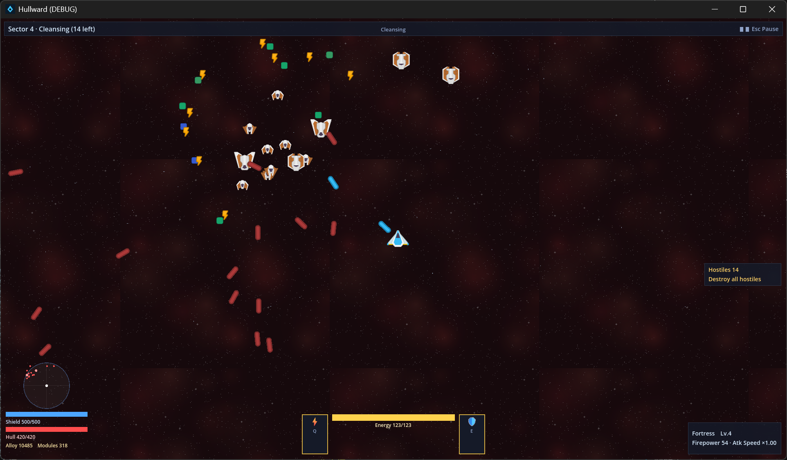

# Hullward《深空暗骸》



太空舰船 ARPG 刷宝游戏 —— Deakin SIT771 "Something Awesome" 7.4H 项目
技术栈：**Godot 4.7.2（.NET 版）+ C# / .NET 8**

## 玩法（任务制循环 · UI 规格 v0.2）

1. **主菜单**：开始新的远征（命名舰长） / 继续游戏（多档存档，只显示舰长名）
2. **星图**：母舰居中，4-8 个随机任务散点（清剿 / BOSS），标注危险等级 ★ 与强度
3. **母舰内部**（仓库/装配/工坊/维修/商店）：出击前的补给与配装
4. **任务战斗**：主炮自动索敌开火 + `Q` 过载炮 / `E` 护盾充能；清剿全部暗骸即胜
5. **结算**：无论成败消耗一次"时间"，返回后星图全部重随机；远征记录自动保存
6. **成长**：任务获得母舰经验 → 母舰升级 → 章节解锁（4 章）+ 商店/工坊解锁更多内容
7. **刷装**：击毁敌舰掉落模块（白/蓝/黄/绿/太古 5 品质 + 词缀）与合金，手动装配 + 词缀洗练

## 母舰内部（LD 规格 §6）

| 标签页 | 功能 |
|---|---|
| 装配 | 槽位可视化（点击选中/装卸）、属性实时预览（火力/护盾/耐久/攻速/抗性/MF）、2 套配装方案 |
| 仓库 | 背包模块列表，按品质筛选（全部/白/蓝/黄/绿/太古） |
| 工坊 | 拆解（白1/蓝3/黄8/绿15 合金，太古不可拆）；洗练（黄+ 重 roll 词缀，费用 5/10/20/40…） |
| 维修 | 耐久恢复（按受损比例计合金） |
| 商店 | 白/蓝模块补给（合金计价，不卖高阶） |

## 词缀系统（LD 词缀表 §3）

- 品质词缀数：白 0 / 蓝 1-2 / 黄 2-3 / 绿 3 / 太古 2（暗金强数值）
- 槽位词缀池按权重抽取，同模块不重复；数值按品质区间均匀随机
- 已接线效果：强化炮击→火力、急速供弹→攻速、护盾扩容→护盾、船体加固→耐久、全向抗性→抗性、打捞增效→MF
- 其余词缀（暴击/减速/范围爆破/能源/EMP 等）生成与洗练闭环可用，战斗效果接口预留

## 操作

| 按键 | 功能 |
|---|---|
| 鼠标 | 菜单 / 星图选任务 / 母舰内部操作 |
| WASD / 方向键 | 移动 |
| Q / E | 过载炮 / 护盾充能 |
| F5 / F9 | 快存 / 读档（结算自动保存）|

## 章节（随母舰等级解锁）

| 章节 | 解锁 | 敌人 |
|---|---|---|
| 第1章 航标 | 初始 | 侦察机、突击舰 |
| 第2章 星港 | 母舰 Lv2 | + 堡垒舰 |
| 第3章 深空 | 母舰 Lv3 | + 虫群 |
| 终章 坍缩 | 母舰 Lv4 | 禁区守卫（Boss）|

## 运行（编辑器/开发）

```powershell
# 双击 run_game.bat（仓库根），或：
D:\pg\Godot_v4.7.2-stable_mono_win64\Godot_v4.7.2-stable_mono_win64.exe --path Hullward
```

## 运行（发布版）

```powershell
Hullward\build\Hullward.exe   # release exe（含 .NET 运行时，无需安装 Godot）
```

## 测试

```powershell
dotnet test Hullward\Hullward.sln    # 105 个域层测试
dotnet build Hullward\Hullward.sln   # 0 error / 0 warning
```

## 存档位置

```
%APPDATA%\Godot\app_userdata\Hullward\saves\<舰长名>.json
```
存档包含：章节/合金/耐久/背包模块（含词缀与洗练次数）/母舰等级经验/**出战装配槽位**。

## 架构

```
Hullward/
├── src/
│   ├── Domain/     # 纯 C# 域层（零 Godot 依赖，xUnit 可测）
│   │   ├── Ships/      # ShipBase 抽象层次（轻巡/突击/战列/要塞）
│   │   ├── Modules/    # IShipModule 接口 + 词缀系统 + 手动装配 + 配装方案
│   │   ├── Enemies/    # EnemyShip 多态层次（侦察/劫掠/堡垒/虫群/Boss）
│   │   ├── Combat/     # 结算 / 索敌 / 主动技能
│   │   ├── Loot/       # 掉落表 / 工坊（拆解/洗练/维修） / 商店
│   │   ├── WorldGen/   # 星域生成 / 星图任务生成 / 章节目录
│   │   └── Save/       # 多文件命名存档（词缀/装配持久化）
│   └── Game/       # Godot 表现层（UI 屏幕 / 母舰面板 / 节点渲染 / 输入 / HUD）
├── tests/           # xUnit 测试项目
├── docs/            # 设计文档 / ULO 证据文档
└── build/           # release exe（git 忽略）
```

设计依据见 `docs/设计文档.md`；过程证据见 `docs/ULO 证据文档.md` 与工程日志。

## 素材

开发期全部为程序化绘制（ColorRect 像素方块）；定稿期可替换 CC0/自绘素材。
