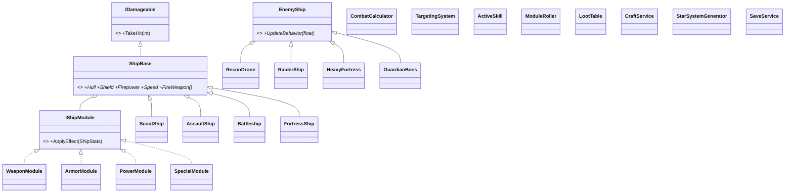

# Hullward — Design Document

> Version: v1.0 ｜ Date: 2026-09-17 ｜ Author: PM / Lead Dev (Doubao)
> Based on: `游戏策划文档.md` v0.4 (LD final) + user decision (2026-09-17 13:39:38: main gun auto-target + manual active skills; pixel art style)
> Purpose: ULO4 evidence (expressing design via diagrams/text); the sole technical reference during development

---

## 1. Architecture overview (layered principle)

| Layer | Contents | Dependencies | Testing |
|---|---|---|---|
| **Domain** | Combat, loot, generation, economy, save, AI logic | Pure C#, **zero Godot dependency** | xUnit via `dotnet test` |
| **Presentation** | Godot nodes: rendering, input, animation, UI | Godot + Domain | Build smoke test + manual playtest |

Iron rule: **the domain layer runs without rendering**; Godot nodes are pure bridges (read domain state and draw it, translate input into domain commands). This is what makes ULO3 (implement and test) evidence strong.

```
proj/Hullward/
├── project.godot
├── Hullward.csproj
├── src/
│   ├── Domain/            # Pure C# domain layer (unit-testable)
│   │   ├── Ships/         # Ship hull hierarchy
│   │   ├── Modules/       # Modules / affixes / rarities
│   │   ├── Enemies/       # Enemy hierarchy + AI state machines
│   │   ├── Combat/        # Settlement + targeting + skills
│   │   ├── Loot/          # Loot table / reroll / economy
│   │   ├── WorldGen/      # Sector generation
│   │   └── Save/          # JSON save
│   └── Game/              # Godot presentation layer (node/scene scripts)
├── tests/Hullward.Tests/  # xUnit test project
└── docs/                  # This design doc + further notes
```

## 2. Domain class design (ULO2 evidence anchor)

### 2.1 Ship hull hierarchy (abstract base + polymorphism)

```
ShipBase (abstract)
 ├─ Hull:int  Shield:int  Firepower:float  Speed:float
 ├─ Modules:List<IShipModule>
 ├─ FireWeapon()*  TakeHit(int dmg)  EquipModule(IShipModule)
 └─ Derived: ScoutShip / AssaultShip / Battleship / FortressShip
```
- Four hull variants: increasing slot count, decreasing mobility (slot framework = fitting freedom)

### 2.2 Module system (interface polymorphism + data-driven)

```
IShipModule { ApplyEffect(ShipStats stats) }
 ├─ WeaponModule   (+firepower / fire rate)
 ├─ ArmorModule    (+shield / resist)
 ├─ PowerModule    (+energy / skill power)
 └─ SpecialModule  (+Magic Find / special effects)
ItemRarity: Common -> Magic -> Rare -> Set -> Ancient
ModuleRoller: rolls affix count and values by rarity (re-rolls Rare+ on reroll)
```

### 2.3 Enemy hierarchy + AI state machine

```
EnemyShip (abstract) { UpdateBehavior(float dt)* }
 ├─ ReconDrone    (fast approach + light fire)
 ├─ RaiderShip    (keep distance + mid-range fire)
 ├─ HeavyFortress (heavy armor/fire, requires flanking / armor break)
 └─ GuardianBoss  (multi-phase guardian of the Collapse Zone)
AI state machine: Patrol -> Chase -> Attack -> (Boss) Phase2
```

### 2.4 Combat settlement and game feel (decision items)

```
CombatCalculator settlement flow:
  Hit damage = max(1, firepower * skill multiplier - resist reduction)
  Shield absorbs first, overflow spills to hull
TargetingSystem: main gun auto-targets (nearest enemy priority, configurable)
ActiveSkill: manual active skills (cooldown, energy cost, effects from modules/talents)
```

### 2.5 Loot and economy

```
LootTable (weighted by sector level) -> ModuleRoller (rolls rarity/affixes)
CraftService: disassemble (module -> alloy) | reroll (alloy -> re-roll affixes) | repair
Economy loop: kill -> module -> good ship / trash disassembled -> alloy -> reroll/repair
```

### 2.6 Generation and save

```
StarSystemGenerator: sector layout + warp gates + points of interest (stations/mines), seeded random
SaveService: JSON serialization (hull/modules/resources/talents), persistent single-player save
```

### 2.7 Class diagram (Mermaid)



## 3. Godot scene tree (presentation layer)

```
Main
 ├─ StarSystemView     (background / sector scene / warp gate rendering)
 ├─ PlayerShipView     (input -> domain hull state; drawing)
 ├─ Enemies            (enemy node container, drives EnemyShip.UpdateBehavior)
 ├─ Projectiles        (projectile container)
 ├─ Pickups            (drop pickups: modules / alloy)
 └─ UI
     ├─ HUD            (shield / hull / energy / skill cooldown / sector indicator)
     ├─ MothershipPanel (mothership: fit / inventory / workshop / repair / shop / dock)
     └─ SettlementPanel (settlement and salvage stats)
```

Input mapping: WASD/arrows to move | main gun auto-targets and fires | skill keys Q/E | short warp Space | open mothership Tab

## 4. Pixel art asset strategy

- **Development**: Godot procedural drawing (rectangle/circle pixel shapes + palette), guarantees daily playable builds
- **Final**: Kenney CC0 pixel pack or AI-generated replacement; source recorded in README / engineering log
- Resolution baseline: 1280x720 window, virtual resolution 640x360 (2x pixel upscale)

## 5. Implementation order (iteration mapping)

| Iteration | Content | Domain (unit tests) | Presentation |
|---|---|---|---|
| **Iter 1** (Day 2) | Sector generation + movement/firing | StarSystemGenerator / TargetingSystem | Camera / collision / firing visuals |
| **Iter 2** (Day 3) | Combat settlement + enemies + loot | CombatCalculator / EnemyShip hierarchy / LootTable | Enemy rendering / hit feedback / drops |
| **Iter 3** (Day 4) | Mothership + 4 sectors + Boss + save | CraftService / SaveService / Boss | Fit UI / sector switching / save |
| **Iter 4** (Day 5-6) | Polish + sfx + balance + pixel assets | Numeric tuning | Effects / UI polish / asset swap |

## 6. Acceptance criteria (aligned with design doc §5)

**Day 2 exit**
- [ ] StarSystemGenerator: sector layout + warp gates + points of interest, unit tests pass
- [ ] Ship movement + auto-target fire + camera + boundary/obstacle collision
- [ ] This design doc contains class diagram / scene tree / acceptance criteria (ULO4 check)

**Day 3 exit**
- [ ] CombatCalculator (shield/resist/hull) pure C# + unit tests
- [ ] At least 2 enemy behaviors that differ (polymorphic dispatch, not if-else)
- [ ] Hit / destroy / drop (module + alloy)

**Day 4 exit**
- [ ] Mothership fit/disassemble/repair working (module swap affects combat stats)
- [ ] 4 sectors of increasing difficulty + Boss + save JSON read/write
- [ ] All new logic has corresponding unit tests

**Throughout**
- [ ] Every iteration `godot build` 0 error 0 warning
- [ ] No fatal bugs after user playtest

## 7. Open questions (PM perspective)

1. Auto-target priority: nearest (default) / lowest-HP — pending user/LD decision, default nearest
2. Manual skill count and keys: MVP 2 skills (Q/E) — if LD wants more, raise before Day 3
3. Pixel asset source: Kenney CC0 vs AI-generated — decide before Day 5

---

## See also
- [[游戏策划文档]] (LD game design doc)
- [[7.4h 项目工作流程]] (project workflow)
- [[协作协议]] (collaboration protocol)
