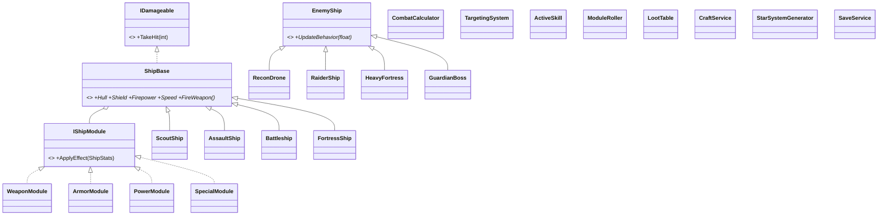

# Hullward《深空暗骸》设计文档

> 版本：v1.0 ｜ 日期：2026-09-17 ｜ 作者：PM/主程（Doubao）
> 依据：`游戏策划文档.md` v0.4（LD 定稿）+ 用户拍板（2026-09-17 13:39:38：主炮自动索敌 + 手动主动技能；像素风）
> 用途：ULO4 证据（用图/文字表达设计）；开发期实现的唯一技术依据

---

## 1. 架构总览（分层原则）

| 层 | 内容 | 依赖 | 测试 |
|---|---|---|---|
| **Domain（域层）** | 战斗、掉落、生成、经济、存档、AI 逻辑 | 纯 C#，**零 Godot 依赖** | xUnit 直接 `dotnet test` |
| **Presentation（表现层）** | Godot 节点：渲染、输入、动画、UI | Godot + Domain | 构建冒烟 + 手动 playtest |

铁律：**域层可脱离渲染运行**；Godot 节点只做桥接（读域状态画出来、把输入转成域命令）。这保证 ULO3（实现并测试）的证据强度。

```
proj/Hullward/
├── project.godot
├── Hullward.csproj
├── src/
│   ├── Domain/            # 纯 C# 域层（可单测）
│   │   ├── Ships/         # 船体层次
│   │   ├── Modules/       # 模块/词缀/品质
│   │   ├── Enemies/       # 敌人层次 + AI 状态机
│   │   ├── Combat/        # 结算 + 索敌 + 技能
│   │   ├── Loot/          # 掉落表/洗练/经济
│   │   ├── WorldGen/      # 星域生成
│   │   └── Save/          # JSON 存档
│   └── Game/              # Godot 表现层（节点/场景脚本）
├── tests/Hullward.Tests/  # xUnit 测试项目
└── docs/                  # 本设计文档 + 后续说明
```

## 2. 域层类设计（ULO2 证据锚点）

### 2.1 船体层次（抽象基类 + 多态）

```
ShipBase (abstract)
 ├─ Hull:int  Shield:int  Firepower:float  Speed:float
 ├─ Modules:List<IShipModule>
 ├─ FireWeapon()*  TakeHit(int dmg)  EquipModule(IShipModule)
 └─ 派生：ScoutShip / AssaultShip / Battleship / FortressShip
```
- 四型船体差异：槽位数递增、机动递减（槽位框架 = 配装自由度）

### 2.2 模块体系（接口多态 + 数据驱动）

```
IShipModule { ApplyEffect(ShipStats stats) }
 ├─ WeaponModule   （+火力/射速）
 ├─ ArmorModule    （+护盾/抗性）
 ├─ PowerModule    （+能源/技能强度）
 └─ SpecialModule  （+MF 寻宝/特殊效果）
ItemRarity: 普通→魔法→稀有→套装→太古
ModuleRoller: 按品质 roll 词缀条数与数值（洗练时重 roll 稀有及以上）
```

### 2.3 敌人层次 + AI 状态机

```
EnemyShip (abstract) { UpdateBehavior(float dt)* }
 ├─ ReconDrone    （高速接近 + 轻火力）
 ├─ RaiderShip    （保持距离 + 中程火力）
 ├─ HeavyFortress （重甲重火力，需绕后/破甲）
 └─ GuardianBoss  （多阶段驻守禁区）
AI 状态机：Patrol → Chase → Attack → (Boss) Phase2
```

### 2.4 战斗结算与手感（拍板项落地）

```
CombatCalculator.结算流程：
  命中伤害 = max(1, 火力 × 技能系数 − 抗性减免)
  护盾优先吸收，溢出转船体耐久
TargetingSystem：主炮自动索敌（最近敌人优先，可配优先级）
ActiveSkill：手动主动技能（冷却、能量消耗、效果由模块/天赋提供）
```

### 2.5 掉落与经济

```
LootTable（按星域等级加权）→ ModuleRoller（roll 品质/词缀）
CraftService：拆解（模块→合金）｜ 洗练（合金→重 roll 词缀）｜ 维修
经济闭环：刷怪 → 模块 → 好装船/垃圾拆解 → 合金 → 洗练/维修
```

### 2.6 生成与存档

```
StarSystemGenerator：星域布局 + 跃迁门 + 功能点（空间站/矿点），种子随机
SaveService：JSON 序列化（船体/模块/资源/天赋），单机永久存档
```

### 2.7 类关系图（Mermaid）



## 3. Godot 场景树（表现层）

```
Main
 ├─ StarSystemView     （背景/星域场景/跃迁门渲染）
 ├─ PlayerShipView     （输入 → 域船体状态；绘制）
 ├─ Enemies            （敌人节点容器，驱动 EnemyShip.UpdateBehavior）
 ├─ Projectiles        （投射物容器）
 ├─ Pickups            （掉落物：模块/合金）
 └─ UI
     ├─ HUD            （护盾/船体/能源/技能冷却/星域指示）
     ├─ StationPanel   （空间站：装配/仓库/工坊/维修）
     └─ SettlementPanel（结算与打捞统计）
```

输入映射：WASD/方向键移动 ｜ 主炮自动索敌自动开火 ｜ 技能键 Q/E ｜ 短距跃迁 Space ｜ 打开空间站 Tab

## 4. 像素风素材策略

- **开发期**：Godot 程序化绘制（矩形/圆形像素形状 + 调色板），保证每天可玩
- **定稿期**：Kenney CC0 像素包或 AI 生成替换，来源记录进 README/工程日志
- 分辨率基线：1280×720 窗口，虚拟分辨率 640×360（2× 像素放大）

## 5. 系统实现顺序（迭代映射）

| 迭代 | 内容 | 域层（单测） | 表现层 |
|---|---|---|---|
| **Iter 1**（Day 2） | 星域生成 + 移动/开火 | StarSystemGenerator / TargetingSystem | 相机/碰撞/开火视觉 |
| **Iter 2**（Day 3） | 战斗结算 + 敌人 + 掉落 | CombatCalculator / EnemyShip 层次 / LootTable | 敌人渲染/受击反馈/掉落物 |
| **Iter 3**（Day 4） | 空间站 + 4 星域 + Boss + 存档 | CraftService / SaveService / Boss | 装配 UI/星域切换/存档 |
| **Iter 4**（Day 5-6） | 打磨 + 音效 + 平衡 + 像素素材 | 数值调优 | 特效/UI 美化/素材替换 |

## 6. 验收标准（对齐策划 §5）

**Day 2 出口**
- [ ] StarSystemGenerator：星域布局 + 跃迁门 + 功能点，单测通过
- [ ] 舰船移动 + 自动索敌开火 + 相机 + 边界/障碍碰撞
- [ ] 本设计文档含类图/场景树/验收标准（ULO4 ✓）

**Day 3 出口**
- [ ] CombatCalculator（护盾/抗性/耐久）纯 C# + 单测
- [ ] 至少 2 种行为不同的暗骸敌舰（多态派发，非 if-else）
- [ ] 受击 / 击毁 / 掉落（模块 + 合金）

**Day 4 出口**
- [ ] 空间站装配/拆解/维修生效（模块替换影响战斗属性）
- [ ] 4 星域难度递增 + Boss + 存档 JSON 读写
- [ ] 新逻辑均有对应单测

**全程**
- [ ] 每次迭代 `godot build` 0 error 0 warning
- [ ] 用户 playtest 后无致命 bug

## 7. 开放问题（PM 视角）

1. 自动索敌目标优先级：最近优先（默认）／ 最低血量优先 —— 待用户/ LD 确认，默认最近
2. 手动技能数量与键位：MVP 2 个技能（Q/E）—— 若 LD 有扩充需求，Day 3 前提出
3. 像素素材来源：Kenney CC0 vs AI 生成 —— Day 5 前定

---

## 相关
- [[游戏策划文档]]
- [[7.4h 项目工作流程]]
- [[协作协议]]
